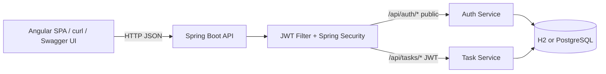

# TaskFlow API

[](https://github.com/Mohangab/taskflow-api/actions/workflows/ci.yml)
[](https://openjdk.org/)
[](https://spring.io/projects/spring-boot)
[](https://angular.dev/)
[](LICENSE)

> A production-style **Task Management REST API** built with **Spring Boot 3**, **JWT authentication**, and **role-based access control (RBAC)**. Includes an **Angular 19** SPA in `frontend/`.

**Author:** Kola Mohan Venkatesh ([@Mohangab](https://github.com/Mohangab))

| | |
|---|---|
| API + Swagger | http://localhost:8080 · [Swagger UI](http://localhost:8080/swagger-ui.html) |
| Angular SPA | http://localhost:4200 — see [Frontend](#frontend-angular) |
| Docker | `docker compose up --build` |

---

## Overview

TaskFlow lets users register, log in, and manage their personal tasks (`TODO` → `IN_PROGRESS` → `DONE`). Admins can list every task in the system. The API is secured with **Spring Security + JWT**, documented with **Swagger / OpenAPI**, and ships with both an **H2** local profile and a **Docker Compose** stack (app + **PostgreSQL**).

### Why this project?

| Resume skill | How it shows up here |
|---|---|
| Java 17 / Spring Boot 3 | Maven project, modern Spring Boot 3.3 |
| Spring Security + JWT + RBAC | Stateless JWT filter, `USER` / `ADMIN` roles |
| REST APIs | Auth + full Task CRUD under `/api/*` |
| MySQL / PostgreSQL | PostgreSQL via Docker; H2 for local demos |
| Docker | Multi-stage `Dockerfile` + `docker-compose.yml` |
| Swagger / OpenAPI | springdoc-openapi UI at `/swagger-ui.html` |
| Maven | Standard multi-module-ready layout, CI-ready |
| Angular / Bootstrap | SPA in `frontend/` — auth, JWT interceptor, task board |

---

## Tech Stack

- **Java 17** · **Spring Boot 3.3** · **Spring Security** · **Spring Data JPA**
- **JWT** (jjwt) · **BCrypt** password hashing
- **H2** (default / local) · **PostgreSQL 16** (Docker profile)
- **springdoc-openapi** (Swagger UI)
- **Maven** · **Docker** / **Docker Compose**
- **JUnit 5** + Mockito
- **Angular 19** · **Bootstrap 5** (SPA in `frontend/`)

---

## Architecture



**Package layout**

```
com.taskflow
├── auth          # register / login
├── config        # Security + OpenAPI
├── security      # JWT service & filter
├── user          # User entity, Role, repository
├── task          # Task entity, CRUD service & controller
└── common        # exceptions + error responses
```

**Access rules (RBAC)**

| Role | Tasks they can access |
|------|------------------------|
| `USER` | Create / read / update / delete **their own** tasks |
| `ADMIN` | List and manage **all** tasks |

---

## API Endpoints

### Auth — `/api/auth`

| Method | Path | Auth | Description |
|--------|------|------|-------------|
| `POST` | `/api/auth/register` | Public | Create account (`USER` role) |
| `POST` | `/api/auth/login` | Public | Login → JWT access token |

### Tasks — `/api/tasks`

| Method | Path | Auth | Description |
|--------|------|------|-------------|
| `GET` | `/api/tasks` | JWT | List tasks (own / all for ADMIN); optional `?status=` & `?q=` title search |
| `GET` | `/api/tasks/{id}` | JWT | Get one task |
| `POST` | `/api/tasks` | JWT | Create task |
| `PUT` | `/api/tasks/{id}` | JWT | Update task |
| `DELETE` | `/api/tasks/{id}` | JWT | Delete task |

Interactive docs: [http://localhost:8080/swagger-ui.html](http://localhost:8080/swagger-ui.html)

---

## Prerequisites

- **JDK 17+** (project targets Java 17; JDK 21 also works)
- **Maven 3.9+** (or use the included Maven Wrapper after generation)
- **Docker Desktop / Docker Engine + Compose** (optional, for containerized run)
- **Node.js 18+** and npm (for the Angular frontend)

---

## Run locally with Maven (H2)

Fastest way to try the API — no database install needed.

```bash
# clone
git clone https://github.com/Mohangab/taskflow-api.git
cd taskflow-api

# build
mvn clean package

# run (default profile → in-memory H2)
mvn spring-boot:run
```

App: **http://localhost:8080**  
Swagger: **http://localhost:8080/swagger-ui.html**  
H2 console: **http://localhost:8080/h2-console**  
(JDBC URL: `jdbc:h2:mem:taskflow`, user: `sa`, blank password)

---

## Run with Docker (beginner-friendly)

This project is a great first Docker exercise: one multi-stage build for the Java app, and Compose to wire it to PostgreSQL.

### What each file does

| File | Purpose |
|------|---------|
| `Dockerfile` | **Multi-stage build** — stage 1 compiles with Maven; stage 2 copies only the JAR into a slim JRE image |
| `docker-compose.yml` | Starts **PostgreSQL + the API** together, with health checks and env-based config |
| `.env.example` | Template for secrets (copy to `.env` — never commit `.env`) |
| `application-docker.yml` | Spring profile used inside the container (PostgreSQL) |

### Step-by-step

```bash
# 1. Optional: customize secrets
cp .env.example .env
# edit .env — set APP_JWT_SECRET and POSTGRES_PASSWORD

# 2. Build the image and start both services
docker compose up --build

# 3. Wait until you see Spring Boot "Started TaskflowApiApplication"
# 4. Open Swagger → http://localhost:8080/swagger-ui.html

# Stop everything
docker compose down

# Stop and wipe the Postgres volume
docker compose down -v
```

### Useful Docker commands while learning

```bash
# See running containers
docker compose ps

# Follow API logs
docker compose logs -f app

# Rebuild only the app after a code change
docker compose up --build -d app

# Open a shell inside the API container
docker compose exec app sh
```

The Compose file injects database credentials and the JWT secret via **environment variables** — nothing sensitive is hardcoded in source.

---

## Sample `curl` workflow

```bash
# 1) Register
curl -s -X POST http://localhost:8080/api/auth/register \
  -H "Content-Type: application/json" \
  -d '{"email":"alice@example.com","password":"secret123"}'

# 2) Login (copy accessToken from the response)
curl -s -X POST http://localhost:8080/api/auth/login \
  -H "Content-Type: application/json" \
  -d '{"email":"alice@example.com","password":"secret123"}'

# 3) Create a task (replace TOKEN)
curl -s -X POST http://localhost:8080/api/tasks \
  -H "Authorization: Bearer TOKEN" \
  -H "Content-Type: application/json" \
  -d '{"title":"Ship portfolio project","description":"Finish TaskFlow API README","status":"TODO"}'

# 4) List tasks (optional: ?status=TODO&q=portfolio)
curl -s 'http://localhost:8080/api/tasks?status=TODO&q=portfolio' \
  -H "Authorization: Bearer TOKEN"

# 5) Update task status
curl -s -X PUT http://localhost:8080/api/tasks/1 \
  -H "Authorization: Bearer TOKEN" \
  -H "Content-Type: application/json" \
  -d '{"title":"Ship portfolio project","description":"Done","status":"DONE"}'
```

**Task status values:** `TODO` | `IN_PROGRESS` | `DONE`

---


## Frontend (Angular)

A polished **Angular 19** SPA lives in [`frontend/`](frontend/). It talks to this API over HTTP with JWT Bearer auth.

### Features

- Register / Login (JWT stored in `localStorage`)
- Auth guard on task routes + HTTP interceptor (`Authorization: Bearer …`)
- Task board: create, edit, change status, delete, filter by status
- Bootstrap 5 UI with loading and error states

### Run locally (two terminals)

**Terminal 1 — API**

```bash
cd taskflow-api
mvn spring-boot:run
```

**Terminal 2 — Angular**

```bash
cd taskflow-api/frontend
npm install
npm start
```

Open **http://localhost:4200** — register a user, then manage tasks.

The Angular app calls `http://localhost:8080` (see `frontend/src/environments/environment.ts`). Spring Security CORS allows the Angular origin `http://localhost:4200`.

### Production / proxy tip

Serve the Angular build behind nginx (or Spring static resources) and reverse-proxy `/api` to the backend so the browser uses same-origin requests. Then set `apiUrl` to `''` in the environment file. Example nginx snippet:

```nginx
location /api/ {
  proxy_pass http://app:8080/api/;
}
location / {
  try_files $uri $uri/ /index.html;
}
```

Build the SPA with:

```bash
cd frontend
npm run build
# output → frontend/dist/frontend/browser
```

---
## Configuration

| Property / Env var | Default (local) | Description |
|--------------------|-----------------|-------------|
| `APP_JWT_SECRET` | Dev secret in `application.yml` | Signing key (≥ 32 bytes) |
| `APP_JWT_EXPIRATION_MS` | `86400000` (24h) | Access token TTL |
| `SPRING_DATASOURCE_*` | H2 in-memory | Overridden in Docker profile |
| `server.port` | `8080` | HTTP port |

---

## Testing

```bash
mvn test
# or skip tests when packaging
mvn package -DskipTests
```

Includes unit tests for `TaskService` (create, list with RBAC, not-found) and a Spring context load test.

---

## Project structure

```
taskflow-api/
├── Dockerfile
├── docker-compose.yml
├── .env.example
├── .gitignore
├── pom.xml
├── README.md
├── .github/workflows/ci.yml
├── frontend/                 # Angular 19 SPA
│   ├── src/app/
│   ├── src/environments/
│   └── package.json
└── src/
    ├── main/java/com/taskflow/...
    ├── main/resources/
    │   ├── application.yml
    │   └── application-docker.yml
    └── test/java/com/taskflow/...
```

---

## License

MIT — feel free to fork for learning or interview prep.

---

<sub>Built to demonstrate Java Full Stack skills: Spring Boot 3 · Angular · Spring Security · JWT · RBAC · REST · JPA · PostgreSQL · Docker · OpenAPI · Bootstrap.</sub>
